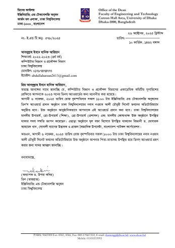
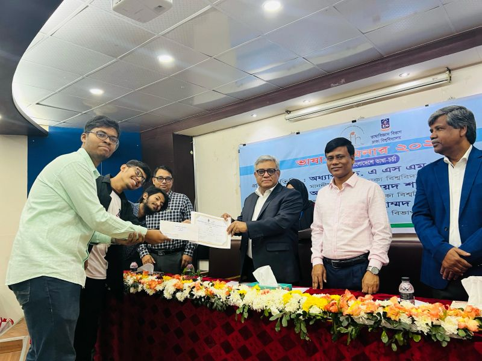
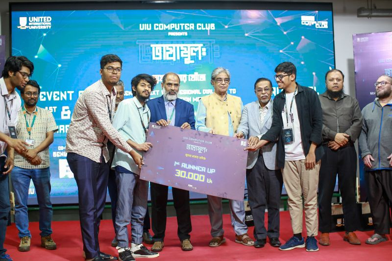
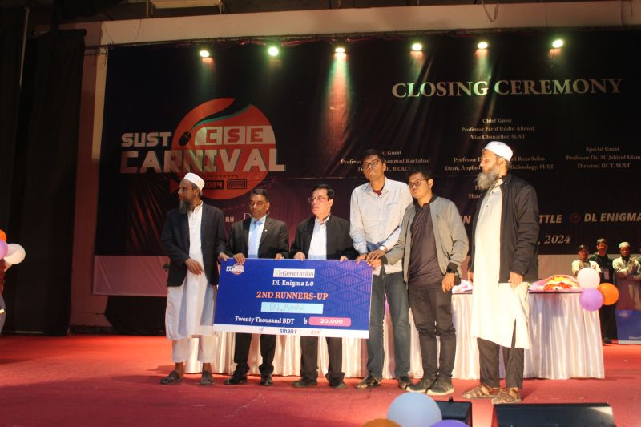
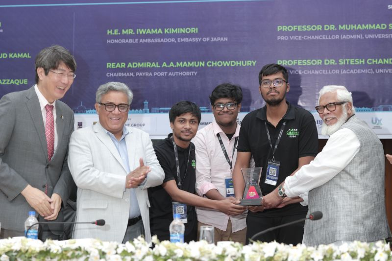
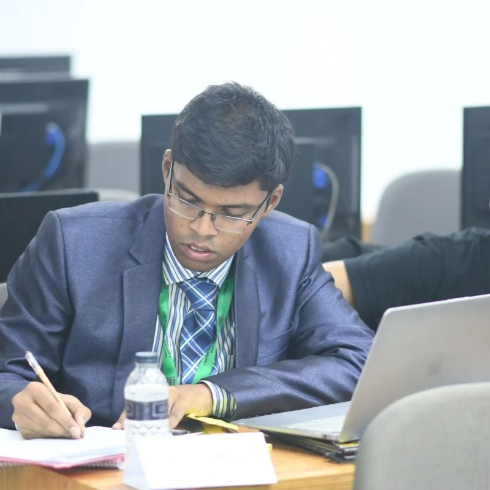
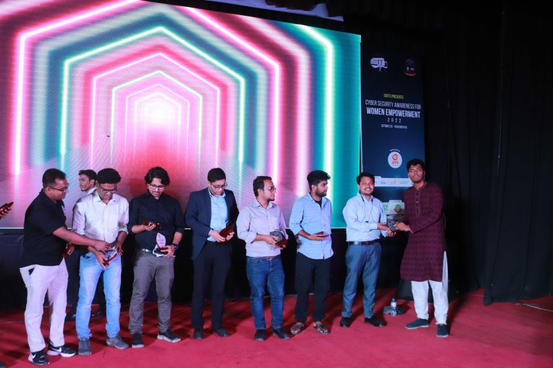
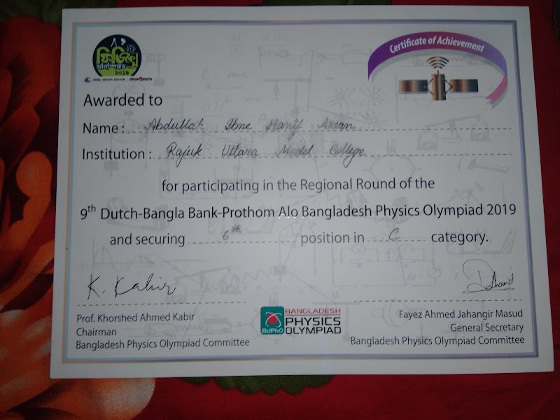
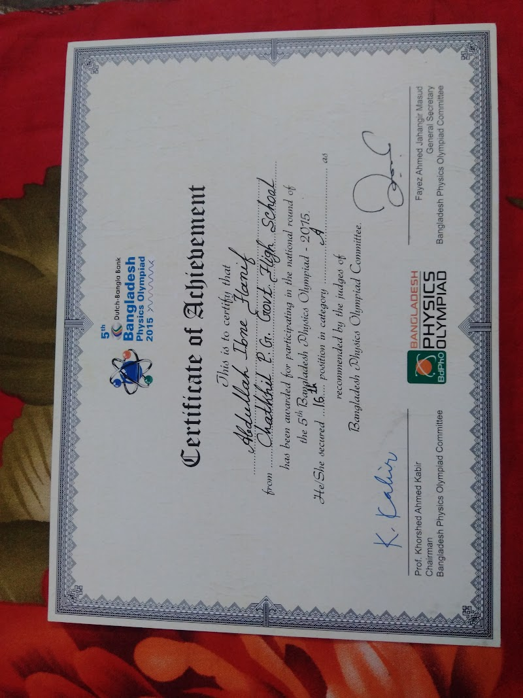
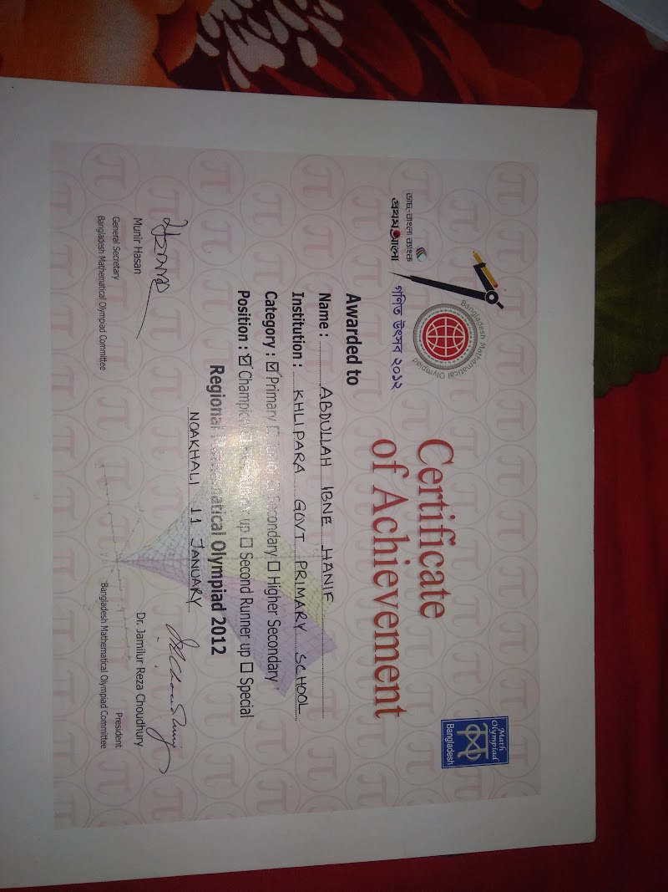

  

<h1 align="center">Abdullah Ibne Hanif Arean</h1>

  <b>AI Researcher · NLP · Computer Vision · Graph Learning · Trustworthy Multimodal AI</b>

  Building reliable, explainable, and human-centered AI systems for low-resource languages, document understanding, and real-world intelligent applications.

  
  
  
  

  
  
  
  
  

---

## About Me

I am an AI researcher from Dhaka, Bangladesh, working across **natural language processing, computer vision, graph learning, and trustworthy multimodal systems**. My research interests include long-context reasoning, diagram and document understanding, Bangla and low-resource NLP, graph-based learning, and safety-aware AI evaluation.

Alongside research, I work on practical AI systems that connect academic ideas with deployable products. I am also committed to inclusive technology education in Bangladesh and have helped more than **2,000 learners** explore computing, AI, and digital literacy.

---

## Current Focus

- **Vision-language model reliability:** grounding multimodal reasoning to reduce structural and topology hallucinations.
- **Bangla and low-resource NLP:** building datasets, benchmarks, and models for summarization, translation, and cultural knowledge evaluation.
- **Graph-based AI systems:** using graph structure, reasoning pipelines, and explainability for robust decision-making.
- **Applied AI deployment:** turning research-backed AI into scalable tools for education, business, and public-interest use cases.

---

## Education

### University of Dhaka
**B.Sc. in Computer Science and Engineering**  
*January 2020 — June 2025 · Dhaka, Bangladesh*  
**CGPA: 3.90/4.00 · Top of Class**

### Rajuk Uttara Model College
**Higher Secondary School Certificate, Science**  
*June 2017 — July 2019 · Dhaka, Bangladesh*  
**GPA: 5.00/5.00**

### Chatkhil Govt. Pach Gaon High School
**Secondary School Certificate, Science**  
*January 2015 — May 2017 · Noakhali, Bangladesh*  
**GPA: 5.00/5.00**

## Honors & Awards

  
  
  
  

### Academic Excellence

<table>
<tr>
<td width="58%" valign="top">
  
</td>
<td width="42%" valign="top">
  

      
    <a href="https://www.linkedin.com/posts/abdullaharean_areans-deans-award-invitation-activity-7388431943425634304--Csq" target="_blank" rel="noopener noreferrer"><b>Dean's Award for Academic Excellence</b></a> 
  

  <ul>
    <li><b>Institution:</b> Faculty of Engineering & Technology, University of Dhaka</li>
    <li><b>Recognition:</b> Top academic performance in Computer Science & Engineering</li>
    <li><b>Context:</b> CGPA 3.90/4.00 · Top of Class</li>
  </ul>
  

    
  

</td>
</tr>
</table>

### NLP & AI Competitions

<table>
<tr>
<td align="center" width="33%" valign="top">
  
  

     
    <a href="https://www.linkedin.com/posts/abdullaharean_duabrbayanno-naturallanguageprocessing-bengaliheritage-activity-7169360072488239127-G48N" target="_blank" rel="noopener noreferrer"><b>Inter-University NLP Idea Competition</b></a> 
    Linguistics Department, University of Dhaka 
    
  

</td>
<td align="center" width="33%" valign="top">
  
  

     
    <a href="https://www.linkedin.com/posts/abdullaharean_i-am-glad-to-announce-that-my-team-teamkhitakortesi-activity-7173172405664698368-Xx_m" target="_blank" rel="noopener noreferrer"><b>Bhashamul: Inter-University NLP Competition</b></a> 
    United International University 
    
  

</td>
<td align="center" width="33%" valign="top">
  
  

     
    <a href="https://www.linkedin.com/posts/abdullaharean_i-am-thrilled-to-announce-that-our-team-activity-7166064837989462017-Hi8E" target="_blank" rel="noopener noreferrer"><b>DL Enigma 1.0: Deep Learning Competition</b></a> 
    Shahjalal University of Science & Technology 
    
  

</td>
</tr>
</table>

### Hackathons & Service

<table>
<tr>
<td align="center" width="33%" valign="top">
  
  

     
    <a href="https://www.linkedin.com/posts/abdullaharean_codesamuraibd-hackathon-innovation-activity-7196073001052749825-R3Yc" target="_blank" rel="noopener noreferrer"><b>Code Samurai 2024 · Final Round</b></a> 
    University of Dhaka 
    
  

</td>
<td align="center" width="33%" valign="top">
  
  

     
    <a href="https://www.linkedin.com/posts/abdullaharean_participated-in-code-samurai-2022-final-round-activity-7015198888487780352-T0I_" target="_blank" rel="noopener noreferrer"><b>Code Samurai 2022 · Final Round</b></a> 
    University of Dhaka 
    
  

</td>
<td align="center" width="33%" valign="top">
  
  

     
    <a href="https://www.linkedin.com/posts/abdullaharean_alhamdulillah-awarded%F0%9D%97%95%F0%9D%97%B2%F0%9D%98%80%F0%9D%98%81-%F0%9D%97%A9%F0%9D%97%BC%F0%9D%97%B9%F0%9D%98%82-activity-6996676041817669632-7uZK" target="_blank" rel="noopener noreferrer"><b>Best Volunteer Award</b></a> 
    Dhaka University IT Society Annual Function 
    
  

</td>
</tr>
</table>

### Science & Math Olympiads

<table>
<tr>
<td align="center" width="33%" valign="top">
  
  

     
    <a href="https://drive.google.com/file/d/1XfBGqnFZdk5kAWYaxUz4ZkmdEGU7P6x_/view?usp=sharing" target="_blank" rel="noopener noreferrer"><b>Bangladesh Physics Olympiad · Dhaka North Regional Round</b></a> 
    Higher Secondary 
    <a href="https://drive.google.com/file/d/1XfBGqnFZdk5kAWYaxUz4ZkmdEGU7P6x_/view?usp=sharing" target="_blank" rel="noopener noreferrer">View certificate</a>
  

</td>
<td align="center" width="33%" valign="top">
  
  

     
    <a href="https://drive.google.com/file/d/1XLt8IC6A7_Bl-xvwRiApj6gesTwLQSEm/view?usp=sharing" target="_blank" rel="noopener noreferrer"><b>Bangladesh Physics Olympiad · National Round</b></a> 
    Junior 
    <a href="https://drive.google.com/file/d/1XLt8IC6A7_Bl-xvwRiApj6gesTwLQSEm/view?usp=sharing" target="_blank" rel="noopener noreferrer">View certificate</a>
  

</td>
<td align="center" width="33%" valign="top">
  
  

     
    <a href="https://drive.google.com/file/d/1WYHBiMhgMp29h7E2210-LBOyDajiJbTv/view?usp=sharing" target="_blank" rel="noopener noreferrer"><b>Bangladesh Mathematical Olympiad · Noakhali Region</b></a> 
    Primary 
    <a href="https://drive.google.com/file/d/1WYHBiMhgMp29h7E2210-LBOyDajiJbTv/view?usp=sharing" target="_blank" rel="noopener noreferrer">View certificate</a>
  

</td>
</tr>
</table>

---

## Research & Publications

### [Stroke-Level Connectivity Verification: Grounding Vision-Language Models Against Topology Hallucination](https://www.linkedin.com/posts/abdullaharean_icdar2026-documentanalysis-visionlanguagemodels-activity-7462140293249650689-WpDO)
**ICDAR 2026 · 20th International Conference on Document Analysis and Recognition**  
**Authors:** [**Abdullah Ibne Hanif Arean**](https://openreview.net/profile?id=~Abdullah_Ibne_Hanif_Arean1), Niamul Hassan Samin, Md Arifur Rahman, Renu Akter Suity, Juena Ahmed Noshin, Md Ashikur Rahman

- Introduces **Stroke-Level Connectivity Verification (SLCV)** to ground diagram reasoning in continuous pixel-level stroke paths.
- Proposes **PaRCO**, a modular architecture that separates structural reconstruction, semantic reasoning, and constraint validation.
- Frames topology-aware verification as a reusable primitive for reliable multimodal document understanding.

### [SOMAJGYAAN: Evaluating LLMs on Bangla Culture and Social Knowledge](https://aclanthology.org/2025.findings-ijcnlp.134/)
**AACL-IJCNLP 2025 Findings** · [OpenReview](https://openreview.net/forum?id=iE3WjTJq8s)  
**Authors:** Fariha Anjum Shifa, Muhtasim Ibteda Shochcho, [**Abdullah Ibne Hanif Arean**](https://openreview.net/profile?id=~Abdullah_Ibne_Hanif_Arean1), Mohammad Ashfaq Ur Rahman, Akm Moshiur Rahman Mazumder, Ahaj Faiak, Md Fahim, M. Ashraful Amin, Amin Ahsan Ali, AKM Mahbubur Rahman

- Introduces a **4,234-question Bangla benchmark** for evaluating cultural and social knowledge in LLMs.
- Benchmarks open-source and closed-source models and analyzes remaining gaps after LoRA fine-tuning.
- Expands Bangla LLM evaluation beyond STEM-heavy datasets toward local culture, society, and commonsense knowledge.

### [Automatic Vehicle Detection Using DETR: A Transformer-Based Approach for Navigating Treacherous Roads](https://arxiv.org/abs/2502.17843)
**arXiv Preprint · February 2025**  
**Authors:** Istiaq Ahmed Fahad, **Abdullah Ibne Hanif Arean**, Nazmus Sakib Ahmed, Mahmudul Hasan

- Develops a DETR-based framework for automatic vehicle detection in complex road, lighting, and weather conditions.
- Uses Co-DETR with collaborative hybrid assignment training to improve feature learning and training supervision.
- Compares DETR variants and YOLO baselines on BadODD to study robustness for real-world autonomous navigation.

---

## Experience

### Junior AI Researcher — The KOW Company
*June 2025 — Present · Dhaka, Bangladesh · Full-time, On-site*

- Developing graph-based reasoning pipelines to improve multimodal interpretation in vision-language models.
- Leading research on specialized VLMs for diagram understanding, with focus on structural grounding and hallucination reduction.
- Applying explainable AI principles to support deployment in safety-critical and high-reliability domains.

### Co-Founder & CDOO — Sigmoix AI
*July 2025 — Present · United States · Remote, Part-time*

- Co-leading the development of enterprise-focused AI systems with emphasis on measurable business impact.
- Overseeing production-ready AI deployment pipelines for scalable integration into real-world workflows.
- Building research-backed AI, NLP, and automation systems for business decision-making and operational efficiency.

### Advisor — Nexaus
*December 2025 — Present · Dhaka, Bangladesh · Part-time*

- Advising digital transformation initiatives for EIIN-registered schools and colleges through Amar IMS.
- Supporting SaaS-based solutions for academic administration, data collection, payment management, and operational efficiency.
- Providing technical and strategic guidance for scalable, secure, and cost-effective IT deployment.

### Research Assistant — Cognitive Agents and Interaction Lab, CSE, University of Dhaka
*January 2024 — May 2025 · Dhaka, Bangladesh · Full-time*

- Collected and processed Bangla-language datasets containing more than **50 million sentences**.
- Built LLM-based systems for Bangla summarization, translation, and related NLP tasks.
- Contributed to Bangla handwritten image recognition research and dataset preparation.

### AI Research Associate — RoboFication LLC
*April 2025 — May 2025 · United States · Remote, Part-time*

- Developed AI-driven tools using large language models and modern automation techniques.
- Collaborated with engineers on validation, verification, and workflow automation.

<b>Earlier Experience</b>

### Software Engineer Intern — D-Ready
*April 2024 — August 2024 · United Kingdom · Remote, Part-time*

- Worked on AI-supported solutions for fish production and aquaculture workflows.
- Collaborated with the team to integrate AI components into real-time systems.

### Freelance Software Developer — Masters Admission Program Project, University of Dhaka
*May 2023 — August 2023 · Dhaka, Bangladesh · Part-time*

- Designed and developed a system to automate the Masters admission process at the University of Dhaka.
- Conducted stakeholder interviews, translated requirements into technical specifications, and implemented backend/database modules.
- Maintained the system throughout its lifecycle and coordinated delivery within the required timeline.

### Software Engineer Intern — MetroScientific
*September 2022 — December 2022 · Dhaka, Bangladesh · Remote, Part-time*

- Worked on custom Linux kernel development for a storage device.
- Contributed system-level C programming for low-level storage functionality.
- Helped improve device performance through kernel customization and optimization.

---

## Selected Projects

### [PressWiz](https://cognistorm.ai/presswiz)
*June 2024 — March 2025 · Web Application · [Presentation](https://docs.google.com/drawings/d/1Vf9rOjCAEey3M1n5yTMgTJZPAY5EgErZ01C3hPsvEhM/edit?usp=sharing) · [Thesis](https://drive.google.com/file/d/1W2ku8RN8v1oC3i1IgMh21az4pTyZyDMA/view?usp=sharing)*

- Built a Bangla news aggregation platform that ingests, normalizes, and summarizes articles from multiple publishers.
- Designed **LongBanSum**, a T5-based long-sequence summarization model using local-global attention.
- Curated **MASBA**, a 669,699-article Bangla corpus with multi-level human-written summaries.

### [Meramot: Comprehensive Tech Services Platform](https://github.com/AbdullahArean/Meramot)
*January 2023 — June 2023*

- Developed a centralized portal for on-demand IT support and common technical services.
- Led service-flow design, technical documentation, and release coordination.
- Implemented backend services using Spring Boot, Spring MVC, Java, authentication, and RESTful APIs.

### [Climate Relief](https://github.com/AbdullahArean/climaterelief)
*July 2022 — November 2022 · [Presentation](https://www.linkedin.com/posts/abdullaharean_climate-relief-android-java-app-presentation-activity-6995318065198497792-78-o?utm_source=social_share_send&utm_medium=member_desktop_web&rcm=ACoAADA0SqcBFs_96NpHtIVeS5AoqAZzWIEeQ28)*

- Developed an Android application in Java for disaster relief distribution and resource tracking.
- Designed a secure backend API and SQLite schema for reliable updates, data integrity, and offline resilience.

<b>More Projects</b>

### [Uposthit: Attendance Management System](https://github.com/AbdullahArean/uposthit)
*July 2022 — December 2023*

- Led end-to-end development of a scalable attendance management system.
- Coordinated stakeholder interviews, requirements, and technical design.
- Implemented biometric and QR-code check-in features with a JavaFX frontend.

### [Hospice: Hospital Management Suite](https://github.com/AbdullahArean/Hospice)
*April 2022 — June 2022*

- Built a modular hospital management system using JavaFX and MySQL.
- Developed patient registration, appointment scheduling, inventory management, and role-based access control modules.

### [War of Independence-1971 Game](https://github.com/AbdullahArean/woi-1971)
*May 2021 — August 2021*

- Created a C/C++ SDL2 action game inspired by the history of Bangladesh's Liberation War.
- Implemented custom physics, sprite animation, AI-driven enemy behavior, sound effects, and cross-platform packaging.

---

## Technical Skills

| Area | Skills |
|---|---|
| **Languages** | Python, C, C++, Java, JavaScript, Dart |
| **AI & Machine Learning** | PyTorch, TensorFlow, Transformers, NLP, Computer Vision, Generative AI, RAG, Fine-tuning, Vector Databases |
| **Frameworks** | React, Node.js, Flutter, Spring Boot, Spring MVC |
| **Databases** | MongoDB, PostgreSQL, SQLite, MySQL |
| **Systems** | Distributed Systems, Multi-tier Architecture, RDBMS Design, Scalability, Linux, System-level Programming |
| **CS Fundamentals** | Data Structures, Algorithms, Operating Systems, OOP, Complexity Analysis |
| **Research Strengths** | Dataset Curation, Experimental Design, Evaluation Methodology, Technical Writing, Reproducible Research |
| **Professional Strengths** | Communication, Leadership, Mentoring, Adaptability, Problem Decomposition, Fast Learning |

  
  
  
  
  
  
  
  

---

## Leadership & Service

### President — 11th Executive Committee, Dhaka University IT Society
*May 2025 — April 2026 · Dhaka, Bangladesh*

- Leading student initiatives that promote digital literacy, practical computing, and technology awareness.
- Organized and conducted sessions on PC building, academic search skills, and cybersecurity awareness for women.
- Strengthening collaboration among students, alumni, educators, and technology professionals.

### Member — Health-Related Subcommittee, Ministry of Health and Family Welfare, Government of Bangladesh
*August 2024 — March 2025 · Dhaka, Bangladesh*

- Collected and analyzed casualty and martyrdom-related data from the July Revolution in collaboration with MIS.
- Served as student representative of Shaheed Suhrawardy Medical College and helped lead the July Shaheed Smrity Foundation Help Center.

### Chair — IEEE Computer Society Student Branch, University of Dhaka
*January 2024 — February 2025 · Dhaka, Bangladesh*

- Led the IEEE Computer Society Student Branch Executive Committee at the University of Dhaka.
- Coordinated technical events, workshops, seminars, and student engagement initiatives.
- Promoted IEEE Computer Society activities and collaboration within the academic community.

---

## Collaboration Interests

I am open to research and engineering collaborations in:

- Bangla and low-resource NLP
- Multilingual LLM safety and evaluation
- Vision-language model grounding and hallucination reduction
- Diagram, document, and structured visual reasoning
- Graph learning and explainable AI
- AI for education, public-interest technology, and inclusive digital access

---

<b>GitHub Activity & Stats</b>

  

  
  

  

  

